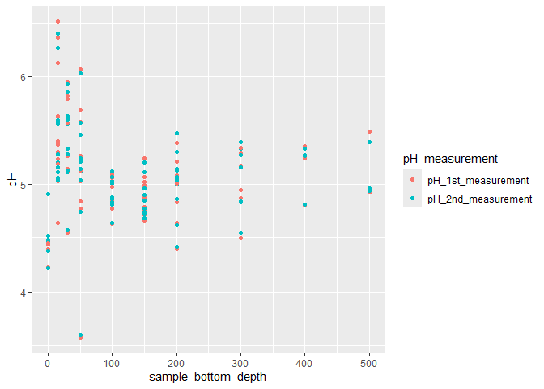
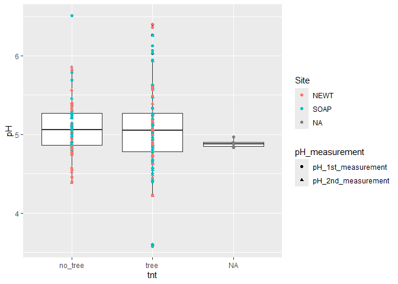
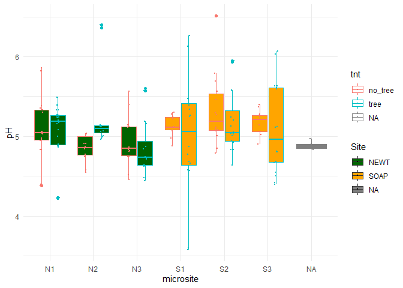
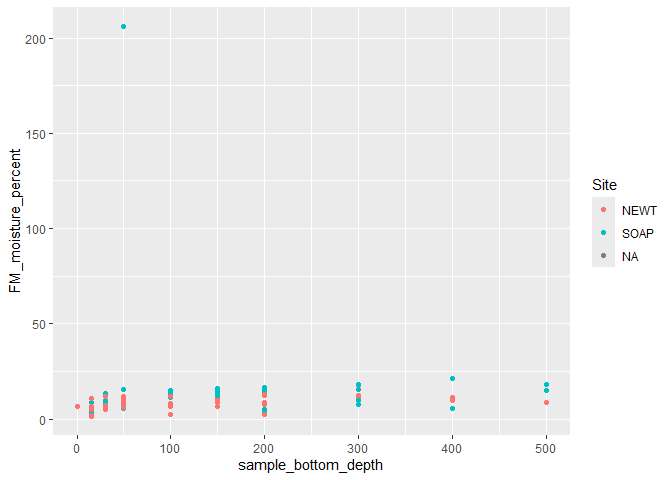
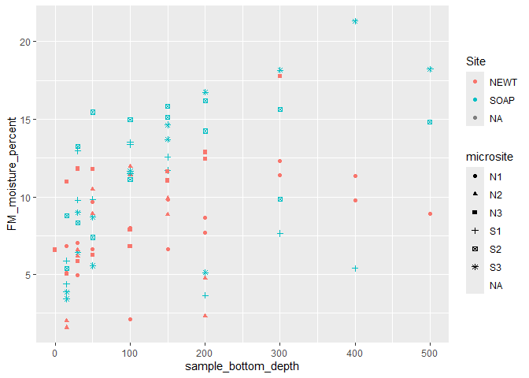
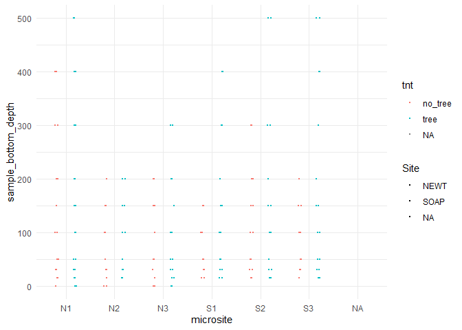

pH_analysis
================

exploratory and messy; 14 Aug 2026 AG

``` r
library(tidyverse)
```

    ## ── Attaching core tidyverse packages ──────────────────────── tidyverse 2.0.0 ──
    ## ✔ dplyr     1.2.1     ✔ readr     2.2.0
    ## ✔ forcats   1.0.1     ✔ stringr   1.6.0
    ## ✔ ggplot2   4.0.3     ✔ tibble    3.3.1
    ## ✔ lubridate 1.9.5     ✔ tidyr     1.3.2
    ## ✔ purrr     1.2.2     
    ## ── Conflicts ────────────────────────────────────────── tidyverse_conflicts() ──
    ## ✖ dplyr::filter() masks stats::filter()
    ## ✖ dplyr::lag()    masks stats::lag()
    ## ℹ Use the conflicted package (<http://conflicted.r-lib.org/>) to force all conflicts to become errors

``` r
library(ggplot2)
```

``` r
psm = read_csv("../../../TidyData/Metadata/make_per_sample_metadata/Results/DSC_per_sample_metadata_compiled-20260814.csv")
```

    ## Rows: 95 Columns: 65
    ## ── Column specification ────────────────────────────────────────────────────────
    ## Delimiter: ","
    ## chr (46): Sample_ID, Sampling_date, Scribe_initials, Siever_1_initials, Siev...
    ## dbl (18): sieve_date, sample_bottom_depth, empty_tin_mass_g, field_moist_plu...
    ## lgl  (1): notes
    ## 
    ## ℹ Use `spec()` to retrieve the full column specification for this data.
    ## ℹ Specify the column types or set `show_col_types = FALSE` to quiet this message.

``` r
colnames(psm)
```

    ##  [1] "Sample_ID"                             
    ##  [2] "Sampling_date"                         
    ##  [3] "Scribe_initials"                       
    ##  [4] "Siever_1_initials"                     
    ##  [5] "Siever_2_initials"                     
    ##  [6] "Equip_mgr_initials"                    
    ##  [7] "Lroot_empty_mass_g"                    
    ##  [8] "rock_empty_mass_g"                     
    ##  [9] "empty_sieve_mass_g"                    
    ## [10] "subsampling_start_time"                
    ## [11] "total_wet_mass_w_sieve_g"              
    ## [12] "all_ROOTS_freeze_time"                 
    ## [13] "RNA_A_freeze_time"                     
    ## [14] "RNA_B_and_C_freeze_time"               
    ## [15] "S_DNA_mass_g"                          
    ## [16] "RESP_IS_mass_g"                        
    ## [17] "S_FM_mass_g"                           
    ## [18] "everything_cool_time"                  
    ## [19] "Lroot_full_mass_g"                     
    ## [20] "rock_full_mass_g"                      
    ## [21] "notes_during_collection_annotations"   
    ## [22] "notes_during_transcription_AG"         
    ## [23] "notes_during_transcription_EF"         
    ## [24] "notes_during_collection_narritive"     
    ## [25] "sieve_date"                            
    ## [26] "Lroot_photo_by"                        
    ## [27] "rock_photo_by"                         
    ## [28] "sieving_start_time"                    
    ## [29] "sieving_end_time"                      
    ## [30] "S_pH_mass_g"                           
    ## [31] "small_tin_mass_full_g"                 
    ## [32] "small_tin_mass_empty_g"                
    ## [33] "large_tin_mass_full_g"                 
    ## [34] "all_set_to_dry_time"                   
    ## [35] "Animal_burrow_(Y/N)"                   
    ## [36] "pre_trim_photo_by"                     
    ## [37] "post_trim_photo_by"                    
    ## [38] "removed_soil_mass_g"                   
    ## [39] "tube_length_cm"                        
    ## [40] "other_info_on_sample_tube (if present)"
    ## [41] "Site"                                  
    ## [42] "Core_ID"                               
    ## [43] "fraction"                              
    ## [44] "microsite"                             
    ## [45] "tnt"                                   
    ## [46] "sample_bottom_depth"                   
    ## [47] "empty_tin_mass_g"                      
    ## [48] "field_moist_plus_tin_mass_g"           
    ## [49] "air_dry_plus_tin_mass_g"               
    ## [50] "oven_dry_plus_tin_mass_g"              
    ## [51] "od_notes"                              
    ## [52] "FM_mass_g"                             
    ## [53] "AD_mass_g"                             
    ## [54] "OD_mass_g"                             
    ## [55] "AD_Factor"                             
    ## [56] "OD_Factor"                             
    ## [57] "diff"                                  
    ## [58] "FM_moisture_percent"                   
    ## [59] "AD_moisture_percent"                   
    ## [60] "notes"                                 
    ## [61] "Date.Measured"                         
    ## [62] "approx_soil_mass_g"                    
    ## [63] "CaCl2_mL"                              
    ## [64] "pH_1st_measurement"                    
    ## [65] "pH_2nd_measurement"

pivot so we can look at both measurements

``` r
psm = psm %>%
  pivot_longer(c(pH_1st_measurement, pH_2nd_measurement), names_to = "pH_measurement", values_to = "pH")
```

``` r
ggplot(psm, aes(x = sample_bottom_depth, y = pH, color = pH_measurement)) +
  geom_point() 
```

    ## Warning: Removed 10 rows containing missing values or values outside the scale range
    ## (`geom_point()`).

<!-- -->

``` r
ggplot(psm, aes(x = tnt, y = pH)) +

  geom_boxplot(aes(x = tnt, y = pH)) +
    geom_point(aes(color = Site, shape = pH_measurement))
```

    ## Warning: Removed 5 rows containing non-finite outside the scale range
    ## (`stat_boxplot()`).

    ## Warning: Removed 5 rows containing missing values or values outside the scale range
    ## (`geom_point()`).

<!-- -->

``` r
boxplot = geom_boxplot( # add boxplot layer
                        alpha = 0.3, #make fill mostly transparent
                       color = "gray50", 
                       linewidth = 0.25
                       ) 
#linecolor = scale_color_manual(name = "Tree mortality", values = c("mediumblue", "lightpink2"))

points = geom_jitter( # add raw datapoint layer
                      size = 0.5, 
                     position = position_jitterdodge(jitter.width = 0.15, dodge.width = 0.75) # Dodge so living and dead points are separated and overlay their boxplots. Jitter optional.
                     ) 

fillcolor = scale_fill_manual(name = "Site", values = c("darkgreen", "orange", "grey")) # color the semi-transparent box fill, name legend

dotlinecolor = scale_color_manual(name = "Site", values = c("darkgreen", "orange", "grey")) # color the points and lines, name legend consistently

background = theme_minimal() # visually simplify background


theme = theme(text = element_text(size = 7), # set font size
              plot.margin = margin(t = 13, r = 5.5, b = 5.5, l = 5.5), # set margin widths: widen left margin of each plot so the panel labels can fit in top left. 5.5 is default pt size for margins in ggplot.
              axis.title.x = element_blank(), # no x-axis, if doing shared x-axis later
              legend.position = "bottom"
)
```

``` r
pH = ggplot(psm, aes(microsite, pH, fill = Site, color = tnt)) +
  geom_boxplot() +
  points +
  fillcolor +
  background 

pH
```

    ## Warning: Removed 5 rows containing non-finite outside the scale range
    ## (`stat_boxplot()`).

    ## Warning: Removed 5 rows containing missing values or values outside the scale range
    ## (`geom_point()`).

<!-- -->

``` r
filter(psm, is.na(pH))
```

    ## # A tibble: 5 × 65
    ##   Sample_ID    Sampling_date Scribe_initials Siever_1_initials Siever_2_initials
    ##   <chr>        <chr>         <chr>           <chr>             <chr>            
    ## 1 "\"NOT COLL… 20260617      KN              EF                N/A              
    ## 2 "\"NOT COLL… 20260617      KN              EF                N/A              
    ## 3 "DSC_016B"   fill_in_from… AG              EF                AG               
    ## 4 "DSC_017-SH… fill_in_from… LB/GB           LB/GB             N/A              
    ## 5 "DSC_017-SH… fill_in_from… LB/GB           LB/GB             N/A              
    ## # ℹ 60 more variables: Equip_mgr_initials <chr>, Lroot_empty_mass_g <chr>,
    ## #   rock_empty_mass_g <chr>, empty_sieve_mass_g <chr>,
    ## #   subsampling_start_time <chr>, total_wet_mass_w_sieve_g <chr>,
    ## #   all_ROOTS_freeze_time <chr>, RNA_A_freeze_time <chr>,
    ## #   RNA_B_and_C_freeze_time <chr>, S_DNA_mass_g <chr>, RESP_IS_mass_g <chr>,
    ## #   S_FM_mass_g <chr>, everything_cool_time <chr>, Lroot_full_mass_g <chr>,
    ## #   rock_full_mass_g <chr>, notes_during_collection_annotations <chr>, …

quick look at moisutre; move this once we have that analysis folder
going. also some of these data are still wrong

``` r
ggplot(psm, aes(x = sample_bottom_depth, y = FM_moisture_percent, color = Site)) +
  geom_point() 
```

    ## Warning: Removed 18 rows containing missing values or values outside the scale range
    ## (`geom_point()`).

<!-- -->

``` r
filter(psm, FM_moisture_percent > 200) # weird one is from the sample that was all root
```

    ## # A tibble: 2 × 65
    ##   Sample_ID Sampling_date Scribe_initials Siever_1_initials Siever_2_initials
    ##   <chr>     <chr>         <chr>           <chr>             <chr>            
    ## 1 DSC_073   20260616      CST             KN                N/A              
    ## 2 DSC_073   20260616      CST             KN                N/A              
    ## # ℹ 60 more variables: Equip_mgr_initials <chr>, Lroot_empty_mass_g <chr>,
    ## #   rock_empty_mass_g <chr>, empty_sieve_mass_g <chr>,
    ## #   subsampling_start_time <chr>, total_wet_mass_w_sieve_g <chr>,
    ## #   all_ROOTS_freeze_time <chr>, RNA_A_freeze_time <chr>,
    ## #   RNA_B_and_C_freeze_time <chr>, S_DNA_mass_g <chr>, RESP_IS_mass_g <chr>,
    ## #   S_FM_mass_g <chr>, everything_cool_time <chr>, Lroot_full_mass_g <chr>,
    ## #   rock_full_mass_g <chr>, notes_during_collection_annotations <chr>, …

``` r
ggplot(filter(psm, FM_moisture_percent < 200), aes(x = sample_bottom_depth, y = FM_moisture_percent, color = Site, shape = microsite)) +
  geom_point() 
```

    ## Warning: Removed 6 rows containing missing values or values outside the scale range
    ## (`geom_point()`).

<!-- -->

quick look at depth, coarsely (according to fraction specs, not actual
bottom depth of bottommost samples)

``` r
depth = ggplot(psm, aes(microsite, sample_bottom_depth, fill = Site, color = tnt)) +
  points +
  fillcolor +
  background 

depth
```

    ## Warning: Removed 10 rows containing missing values or values outside the scale range
    ## (`geom_point()`).

<!-- -->
