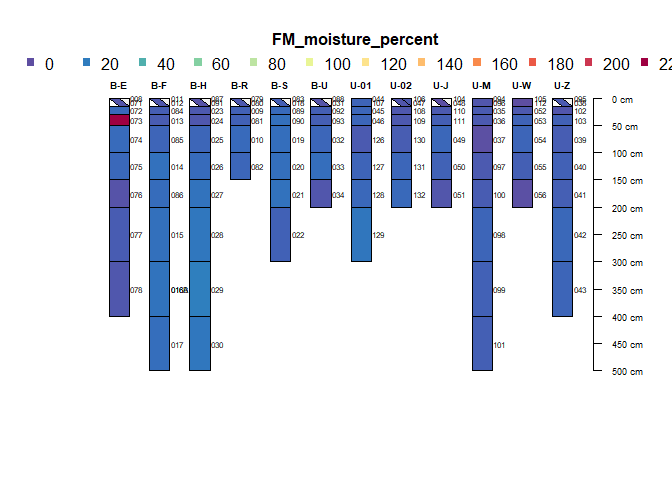
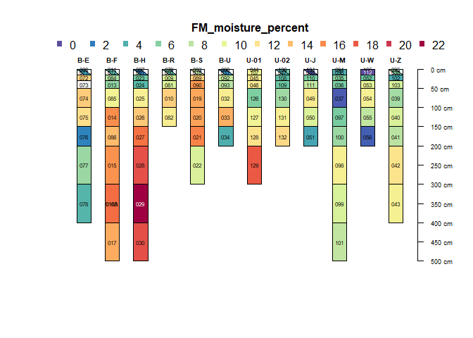
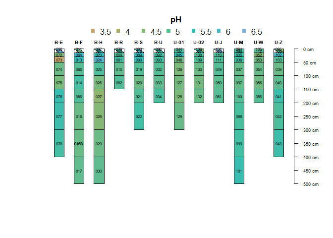
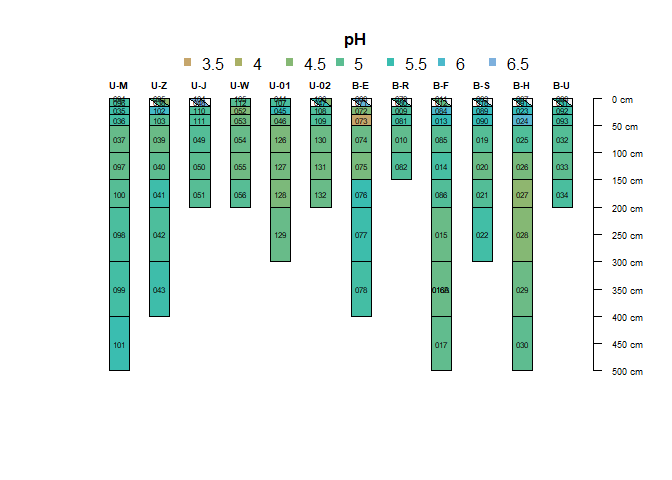
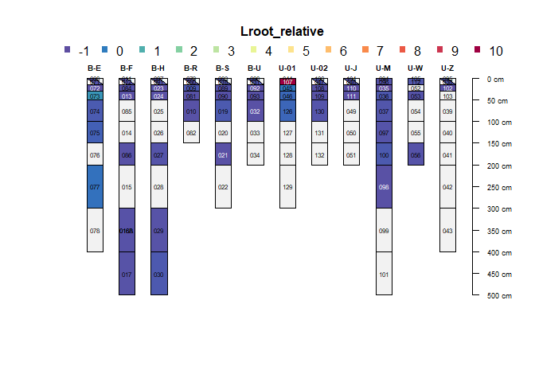
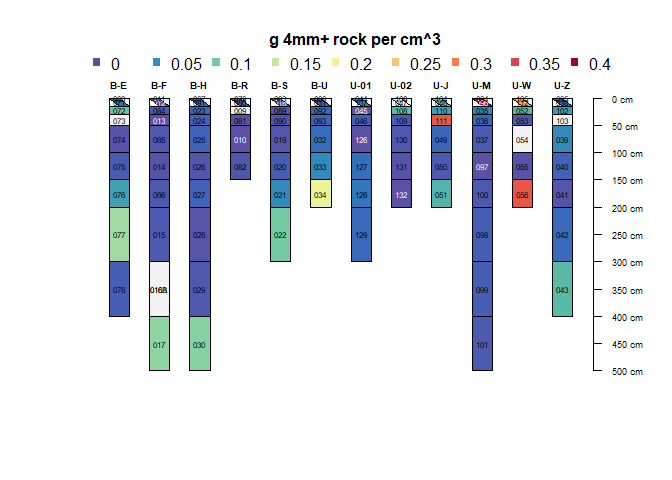
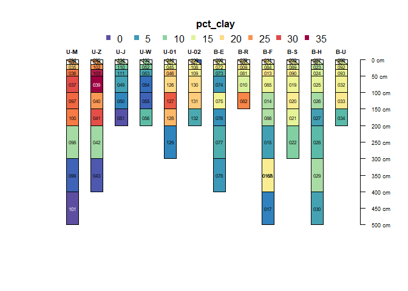
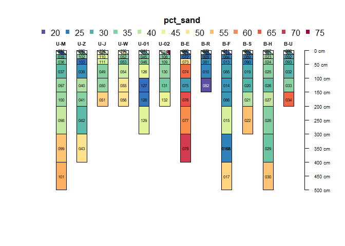
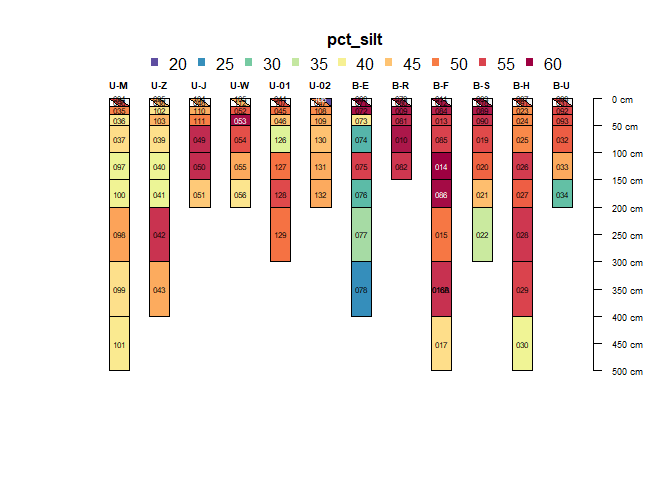

Early DSC June data exploration with plotSPC()
================

``` r
library(tidyverse)
```

    ## ── Attaching core tidyverse packages ──────────────────────── tidyverse 2.0.0 ──
    ## ✔ dplyr     1.2.1     ✔ readr     2.2.0
    ## ✔ forcats   1.0.1     ✔ stringr   1.6.0
    ## ✔ ggplot2   4.0.3     ✔ tibble    3.3.1
    ## ✔ lubridate 1.9.5     ✔ tidyr     1.3.2
    ## ✔ purrr     1.2.2     
    ## ── Conflicts ────────────────────────────────────────── tidyverse_conflicts() ──
    ## ✖ dplyr::filter() masks stats::filter()
    ## ✖ dplyr::lag()    masks stats::lag()
    ## ℹ Use the conflicted package (<http://conflicted.r-lib.org/>) to force all conflicts to become errors

``` r
library(aqp)
```

    ## This is aqp 2.3.2
    ## 
    ## Attaching package: 'aqp'
    ## 
    ## The following objects are masked from 'package:dplyr':
    ## 
    ##     combine, slice

Read in metadata, rename columns to play nice with aqp()

``` r
psm = read_csv("../../../TidyData/Metadata/make_per_sample_metadata/Results/DSC_per_sample_metadata_compiled-20260930.csv")
```

    ## Rows: 102 Columns: 71
    ## ── Column specification ────────────────────────────────────────────────────────
    ## Delimiter: ","
    ## chr (47): Sample_ID, Sampling_date, Scribe_initials, Siever_1_initials, Siev...
    ## dbl (23): sieve_date, sample_bottom_depth, sample_top_depth, empty_tin_mass_...
    ## lgl  (1): notes
    ## 
    ## ℹ Use `spec()` to retrieve the full column specification for this data.
    ## ℹ Specify the column types or set `show_col_types = FALSE` to quiet this message.

``` r
colnames(psm)
```

    ##  [1] "Sample_ID"                             
    ##  [2] "Sampling_date"                         
    ##  [3] "Scribe_initials"                       
    ##  [4] "Siever_1_initials"                     
    ##  [5] "Siever_2_initials"                     
    ##  [6] "Equip_mgr_initials"                    
    ##  [7] "Lroot_empty_mass_g"                    
    ##  [8] "rock_empty_mass_g"                     
    ##  [9] "empty_sieve_mass_g"                    
    ## [10] "subsampling_start_time"                
    ## [11] "total_wet_mass_w_sieve_g"              
    ## [12] "all_ROOTS_freeze_time"                 
    ## [13] "RNA_A_freeze_time"                     
    ## [14] "RNA_B_and_C_freeze_time"               
    ## [15] "S_DNA_mass_g"                          
    ## [16] "RESP_IS_mass_g"                        
    ## [17] "S_FM_mass_g"                           
    ## [18] "everything_cool_time"                  
    ## [19] "Lroot_full_mass_g"                     
    ## [20] "rock_full_mass_g"                      
    ## [21] "notes_during_collection_annotations"   
    ## [22] "notes_during_transcription_AG"         
    ## [23] "notes_during_transcription_EF"         
    ## [24] "notes_during_collection_narritive"     
    ## [25] "sieve_date"                            
    ## [26] "Lroot_photo_by"                        
    ## [27] "rock_photo_by"                         
    ## [28] "sieving_start_time"                    
    ## [29] "sieving_end_time"                      
    ## [30] "S_pH_mass_g"                           
    ## [31] "small_tin_mass_full_g"                 
    ## [32] "small_tin_mass_empty_g"                
    ## [33] "large_tin_mass_full_g"                 
    ## [34] "all_set_to_dry_time"                   
    ## [35] "Animal_burrow_(Y/N)"                   
    ## [36] "pre_trim_photo_by"                     
    ## [37] "post_trim_photo_by"                    
    ## [38] "removed_soil_mass_g"                   
    ## [39] "tube_length_cm"                        
    ## [40] "other_info_on_sample_tube (if present)"
    ## [41] "Site"                                  
    ## [42] "Core_ID"                               
    ## [43] "fraction"                              
    ## [44] "microsite"                             
    ## [45] "tnt"                                   
    ## [46] "sample_bottom_depth"                   
    ## [47] "sample_top_depth"                      
    ## [48] "empty_tin_mass_g"                      
    ## [49] "field_moist_plus_tin_mass_g"           
    ## [50] "air_dry_plus_tin_mass_g"               
    ## [51] "oven_dry_plus_tin_mass_g"              
    ## [52] "od_notes"                              
    ## [53] "FM_mass_g"                             
    ## [54] "AD_mass_g"                             
    ## [55] "OD_mass_g"                             
    ## [56] "AD_Factor"                             
    ## [57] "OD_Factor"                             
    ## [58] "diff"                                  
    ## [59] "FM_moisture_percent"                   
    ## [60] "AD_moisture_percent"                   
    ## [61] "notes"                                 
    ## [62] "Date.Measured"                         
    ## [63] "approx_soil_mass_g"                    
    ## [64] "CaCl2_mL"                              
    ## [65] "pH_1st_measurement"                    
    ## [66] "pH_2nd_measurement"                    
    ## [67] "num"                                   
    ## [68] "pct_clay"                              
    ## [69] "pct_silt"                              
    ## [70] "pct_sand"                              
    ## [71] "silt_clay"

``` r
psm = psm %>% 
  rename(name = Sample_ID,
         id = Core_ID,
         top = sample_top_depth,
         bottom = sample_bottom_depth) %>%
  filter(!is.na(top)) %>%
  mutate(name = stringr::str_remove_all(name, "DSC_"))

depths(psm) <- id ~ top + bottom
```

# Make crude soil moisture plots

``` r
plotSPC(psm, 
        name = 'name',
        color = 'FM_moisture_percent' )
```

<!-- -->

``` r
# mask the all-root sample because it's throwing off the color scale
h = horizons(psm)
h$FM_moisture_percent = as.numeric(h$FM_moisture_percent)
h = h %>% mutate(
  FM_moisture_percent = case_when(
    FM_moisture_percent > 60 ~ NA,
    FM_moisture_percent < 60 ~ FM_moisture_percent
  ))
horizons(psm) = h


plotSPC(psm, 
        name = 'name',
        color = 'FM_moisture_percent',
        name.style = 'center-center')
```

<!-- -->

# Make crude pH plots

``` r
# use average of two pH measurements for each sample
h = horizons(psm)
h = h %>% mutate(
  pH = (pH_1st_measurement + pH_2nd_measurement)/ 2
  )
horizons(psm) = h

plotSPC(psm, 
        name = 'name',
        color = 'pH', 
        col.palette = hcl.colors(14, "Harmonic"),
        name.style = 'center-center')
```

<!-- -->

``` r
library(aqp)
library(dplyr)

# 1. Update pH horizon values
h <- horizons(psm) %>% 
  mutate(pH = (pH_1st_measurement + pH_2nd_measurement) / 2)
horizons(psm) <- h

# 2. Extract Site and microsite from horizons (getting 1 row per profile)
h_site_info <- horizons(psm) %>%
  group_by(id) %>% # replace 'id' with your profile ID column if different (e.g., idcol(psm))
  dplyr::slice(1) %>%
  ungroup()

# 3. Build hierarchical plot order (Site, then microsite)
hierarchical_order <- order(h_site_info$Site, h_site_info$microsite)

# 4. Plot profiles grouped by Site and microsite
plotSPC(
  psm, 
  name = 'name',
  color = 'pH', 
  col.palette = hcl.colors(14, "Harmonic"),
  plot.order = hierarchical_order,
  name.style = 'center-center'
)
```

<!-- -->

# Make crude Lroot plot

``` r
# make Lroot mass numeric
h = horizons(psm)
h = h %>% mutate(
  Lroot_full_mass_g = as.numeric(Lroot_full_mass_g),
  Lroot_empty_mass_g = as.numeric(Lroot_empty_mass_g),
  Lroot_mass = Lroot_full_mass_g - Lroot_empty_mass_g, 
  thickness = bottom - top,
  Lroot_relative = Lroot_mass / thickness

) 
```

    ## Warning: There were 2 warnings in `mutate()`.
    ## The first warning was:
    ## ℹ In argument: `Lroot_full_mass_g = as.numeric(Lroot_full_mass_g)`.
    ## Caused by warning:
    ## ! NAs introduced by coercion
    ## ℹ Run `dplyr::last_dplyr_warnings()` to see the 1 remaining warning.

``` r
horizons(psm) = h


plotSPC(psm, 
        name = 'name',
        color = 'Lroot_relative',
        name.style = 'center-center')
```

<!-- -->

``` r
# ok some of these NAs should be 0s (where there were no roots so nothing was written) but some of them are because we forgot to weight; need to go into notes and tidy this
```

# Make crude rock mass plot

``` r
# make rock mass numeric
h = horizons(psm)
h = h %>% mutate(
  rock_full_mass_g = as.numeric(rock_full_mass_g),
  rock_empty_mass_g = as.numeric(rock_empty_mass_g),
  rock_mass = rock_full_mass_g - rock_empty_mass_g,
  thickness = bottom - top,
  volume = thickness * 4.8 * pi) %>% # double check that ID of tubes was 4.8cm 

  filter(rock_mass >= 0) %>%
  mutate(rock_relative = rock_mass / volume
  ) %>%
  filter(rock_relative != Inf) # temporary issue with 0 thicknesses from os, bc core data not yet entered with o thicknesses
```

    ## Warning: There were 2 warnings in `mutate()`.
    ## The first warning was:
    ## ℹ In argument: `rock_full_mass_g = as.numeric(rock_full_mass_g)`.
    ## Caused by warning:
    ## ! NAs introduced by coercion
    ## ℹ Run `dplyr::last_dplyr_warnings()` to see the 1 remaining warning.

``` r
horizons(psm) <- h


plotSPC(psm, 
        name = 'name',
        color = 'rock_relative',
        col.label = 'g 4mm+ rock per cm^3',
        name.style = 'center-center')
```

<!-- -->

ok data cleaning to-do - make depths actual; use core data to adjust
bottom depths of bottommost samples. Account for shoes - deal with
DSC_106; it needs 3 parts to be in this depth profile and they need
depths assigned - integrate core data!! - add O thicknesses - clean up
NAs in lroot and rock masses; which are actually 0? - add Lroot and rock
masses (with empty masses subtracted) to main psm csv

# Make crude texture plots

``` r
# 2. Extract Site and microsite from horizons (getting 1 row per profile)
h_site_info <- horizons(psm) %>%
  group_by(id) %>% # replace 'id' with your profile ID column if different (e.g., idcol(psm))
  dplyr::slice(1) %>%
  ungroup()

# 3. Build hierarchical plot order (Site, then microsite)
hierarchical_order <- order(h_site_info$Site, h_site_info$microsite)

plotSPC(psm, 
        name = 'name',
        color = 'pct_clay',
        name.style = 'center-center',
        plot.order = hierarchical_order)
```

<!-- -->

``` r
plotSPC(psm, 
        name = 'name',
        color = 'pct_sand',
        name.style = 'center-center',
        plot.order = hierarchical_order)
```

<!-- -->

``` r
plotSPC(psm, 
        name = 'name',
        color = 'pct_silt',
        name.style = 'center-center',
        plot.order = hierarchical_order)
```

<!-- -->

# Make crude depth plot without O horizons

## (based on target depts for each fraction, not actual depths)

``` r
psm_noO <- subsetHz(psm, bottom != 0)

# Extract and filter
h <- horizons(psm_noO)

h$name
```

    ##  [1] "071"  "072"  "073"  "074"  "075"  "076"  "077"  "078"  "012"  "084" 
    ## [11] "013"  "085"  "014"  "086"  "015"  "016A" "016B" "017"  "091"  "023" 
    ## [21] "024"  "025"  "026"  "027"  "028"  "029"  "030"  "080"  "009"  "081" 
    ## [31] "010"  "082"  "018"  "089"  "090"  "019"  "020"  "021"  "022"  "031" 
    ## [41] "092"  "093"  "032"  "033"  "034"  "107"  "045"  "046"  "126"  "127" 
    ## [51] "128"  "129"  "047"  "108"  "109"  "130"  "131"  "132"  "048"  "110" 
    ## [61] "111"  "049"  "050"  "051"  "096"  "035"  "036"  "037"  "097"  "100" 
    ## [71] "098"  "099"  "101"  "112"  "052"  "053"  "054"  "055"  "056"  "038" 
    ## [81] "102"  "103"  "039"  "040"  "041"  "042"  "043"

``` r
# 3. Build hierarchical plot order (Site, then microsite)
hierarchical_order <- order(h_site_info$Site, h_site_info$microsite)

# Re-assign using replaceHorizons to enforce validation
replaceHorizons(psm) <- horizons(psm_noO)

plotSPC(psm_noO, 
        color = 'tnt',
        col.label = '',
        plot.order = hierarchical_order,
        col.palette = hcl.colors(2, "Harmonic"),
        name.style = 'center-center')
```

<!-- -->

``` r
write_rds(psm, "Results/plotSPC_object_June.rds")
write_rds(psm_noO, "Results/plotSPC_object_June_noO.rds")
```
